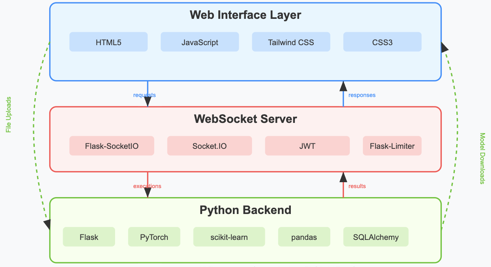
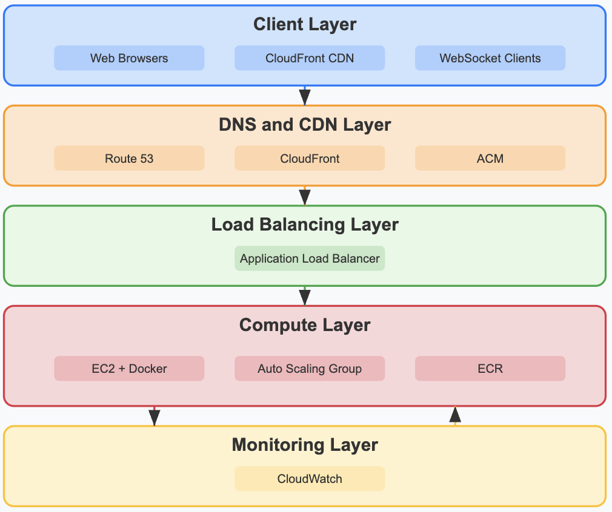

# ByteMe - ML Pipeline Development Platform

ByteMe is a web-based platform that allows users to develop and test machine learning pipelines in a streamlined environment. It provides a code editor with ML templates, real-time execution, and model deployment capabilities.

## Architecture and Data Flow

### High-Level Architecture




This architecture represents the core components of the ByteMe platform:

1. **Web Interface Layer**
   - Frontend Framework: React.js with TypeScript
   - Code Editor: Monaco Editor (VS Code's editor)
   - UI Components: Material-UI (MUI)
   - State Management: Redux Toolkit
   - Build Tool: Vite
   - Testing: Jest and React Testing Library
   - Provides the user interface for code editing and file uploads
   - Handles real-time output display and model downloads
   - Communicates with the backend via WebSocket

2. **WebSocket Server**
   - Framework: Flask-SocketIO
   - Protocol: WebSocket with Socket.IO
   - Authentication: JWT (JSON Web Tokens)
   - Rate Limiting: Flask-Limiter
   - Acts as the communication bridge between frontend and backend
   - Handles real-time bidirectional communication
   - Manages code execution status updates
   - Streams output and error messages

3. **Python Backend**
   - Framework: Flask
   - ML Libraries: PyTorch, scikit-learn, pandas
   - Code Execution: Python's subprocess with resource limits
   - File Handling: Python's tempfile and shutil
   - Database: SQLite (for development), PostgreSQL (for production)
   - ORM: SQLAlchemy
   - Executes ML code in an isolated environment
   - Processes file uploads and data handling
   - Manages ML pipeline execution
   - Handles model training and evaluation

4. **Data Flow**
   - User interactions flow from browser to WebSocket server
   - Code execution requests are processed by the Python backend
   - Results and status updates flow back through WebSocket
   - File uploads are handled separately for better performance

### AWS Architecture



This architecture represents the production deployment of ByteMe on AWS:

1. **Client Layer**
   - Users access the application through their web browsers
   - Static assets are served through CloudFront CDN
   - WebSocket connections are established through ALB

2. **DNS and CDN Layer**
   - Route 53 manages DNS routing and health checks
   - CloudFront provides global content delivery
   - ACM handles SSL/TLS certificate management

3. **Load Balancing Layer**
   - ALB distributes traffic across EC2 instances
   - Handles WebSocket connections
   - Provides SSL termination
   - Manages health checks

4. **Compute Layer**
   - EC2 instances run the application in Docker containers
   - Auto Scaling Group manages instance count
   - ECR stores and distributes Docker images

5. **Monitoring Layer**
   - CloudWatch monitors application metrics
   - Collects logs and performance data
   - Triggers alerts based on defined thresholds

## AWS Deployment Guide

### Prerequisites
- AWS Account
- AWS CLI installed and configured
- Python 3.9+
- Docker installed locally

### 1. Set Up AWS Resources

#### Create an EC2 Instance
```bash
# Create a security group
aws ec2 create-security-group --group-name ByteMe-SG --description "Security group for ByteMe"
aws ec2 authorize-security-group-ingress --group-name ByteMe-SG --protocol tcp --port 22 --cidr 0.0.0.0/0
aws ec2 authorize-security-group-ingress --group-name ByteMe-SG --protocol tcp --port 80 --cidr 0.0.0.0/0
aws ec2 authorize-security-group-ingress --group-name ByteMe-SG --protocol tcp --port 443 --cidr 0.0.0.0/0

# Launch EC2 instance
aws ec2 run-instances \
    --image-id ami-0c55b159cbfafe1f0 \
    --count 1 \
    --instance-type t2.micro \
    --key-name YourKeyPair \
    --security-groups ByteMe-SG
```

### 2. Prepare the Application

#### Create Dockerfile
```dockerfile
FROM python:3.9-slim

WORKDIR /app

COPY requirements.txt .
RUN pip install -r requirements.txt

COPY . .

EXPOSE 8000

CMD ["python", "app.py"]
```

#### Create requirements.txt
```
flask==2.0.1
flask-socketio==5.1.1
pandas==1.3.3
scikit-learn==0.24.2
torch==1.9.0
numpy==1.21.2
```

### 3. Deploy to AWS

#### Build and Push Docker Image
```bash
# Build the Docker image
docker build -t byteme-app .

# Tag the image
docker tag byteme-app:latest your-aws-account-id.dkr.ecr.your-region.amazonaws.com/byteme-app:latest

# Push to ECR
aws ecr create-repository --repository-name byteme-app
docker push your-aws-account-id.dkr.ecr.your-region.amazonaws.com/byteme-app:latest
```

#### Deploy to EC2
```bash
# SSH into your EC2 instance
ssh -i your-key.pem ec2-user@your-ec2-ip

# Install Docker
sudo yum update -y
sudo amazon-linux-extras install docker
sudo service docker start
sudo usermod -a -G docker ec2-user

# Pull and run the Docker container
docker pull your-aws-account-id.dkr.ecr.your-region.amazonaws.com/byteme-app:latest
docker run -d -p 80:8000 your-aws-account-id.dkr.ecr.your-region.amazonaws.com/byteme-app:latest
```

### 4. Set Up Domain and SSL (Optional)

#### Using Route 53 and ACM
```bash
# Create a hosted zone in Route 53
aws route53 create-hosted-zone --name yourdomain.com --caller-reference $(date +%s)

# Request an SSL certificate
aws acm request-certificate --domain-name yourdomain.com --validation-method DNS

# Create an Application Load Balancer
aws elbv2 create-load-balancer --name byteme-alb --subnets subnet-12345678 subnet-87654321 --security-groups sg-12345678
```

### 5. Monitoring and Maintenance

#### Set Up CloudWatch
```bash
# Create a CloudWatch log group
aws logs create-log-group --log-group-name /byteme/app

# Create a CloudWatch alarm
aws cloudwatch put-metric-alarm \
    --alarm-name ByteMe-CPU-Utilization \
    --metric-name CPUUtilization \
    --namespace AWS/EC2 \
    --statistic Average \
    --period 300 \
    --threshold 80 \
    --comparison-operator GreaterThanThreshold \
    --evaluation-periods 2 \
    --alarm-actions arn:aws:sns:region:account-id:your-topic
```

## Security Considerations

1. **Network Security**
   - Use VPC with private subnets
   - Implement security groups
   - Enable SSL/TLS encryption

2. **Application Security**
   - Input validation
   - Code execution sandboxing
   - Secure file handling

3. **Data Security**
   - Temporary file storage
   - Secure model transfer
   - Regular cleanup

## Troubleshooting

1. **Common Issues**
   - WebSocket connection failures
   - File upload errors
   - Model serialization issues

2. **Logs and Monitoring**
   - Check CloudWatch logs
   - Monitor EC2 instance metrics
   - Review application logs

## Contributing

1. Fork the repository
2. Create a feature branch
3. Commit your changes
4. Push to the branch
5. Create a Pull Request

## License

This project is licensed under the MIT License - see the LICENSE file for details. 